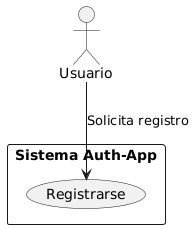
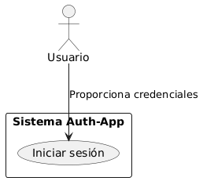
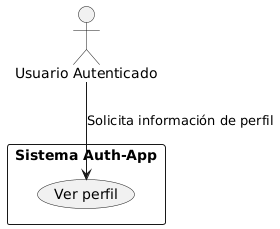
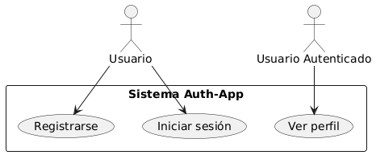

# Nombre: Wuilmar Hamilton López García

# Carné:201901069

### Caso de Uso: Aplicación de Autenticación con Vibe Coding

#### **Objetivo del Caso de Uso**

Desarrollar una aplicación de autenticación (login y registro de usuarios) utilizando una herramienta de Vibe Coding, enfocándose en el diseño rápido, iterativo y asistido por IA.

### Herramienta Vibe Coding Elegida: **ChatGPT + VSCode**

> ChatGpt, como parte del enfoque Vibe Coding, permite la generación automática de código, completado de funciones y diseño de flujos a través de prompts.

### Prompt de Ingreso (Prompt Inicial)

> Crea una aplicación en Node.js con Express que permita registrar y autenticar usuarios utilizando JWT para el manejo de sesiones. Agrega validación de contraseñas con bcrypt y una conexión a una base de datos MySQL utilizando Sequelize.

---

### **Entradas del Prompt**

* Lenguaje: JavaScript (Node.js)
* Framework: Express.js
* Base de datos: MySQL (con Sequelize ORM)
* Seguridad:
  * Encriptación de contraseñas con bcrypt
  * Autenticación con JWT (JSON Web Token)
* Funcionalidades:
  * Registro de usuarios
  * Inicio de sesión
  * Verificación de sesión
* Requerimiento adicional: Generación de endpoints RESTful

---

### Proceso Asistido por Vibe Coding (Workflow)

1. **Prompt en ChatGPT (Editor):** Se ingresa el prompt.
2. **Generación automática del boilerplate:** Estructura básica de Express y rutas.
3. **Iteración de código:** El desarrollador valida el código sugerido, ajusta detalles y prueba funcionalidades.
4. **Testeo en vivo:** Pruebas locales con Postman o frontend ligero.
5. **Optimización sugerida por ChatGpt:** Refactorización, manejo de errores, etc.

### Prompt de Salida (Resultado Esperado)

* Carpeta con estructura:

  ```
  /auth-app
  ├── controllers
  │   └── auth.controller.js
  ├── models
  │   └── user.model.js
  ├── routes
  │   └── auth.routes.js
  ├── middleware
  │   └── auth.middleware.js
  ├── config
  │   └── db.config.js
  ├── db
  │   └── init.sql
  ├── server.js
  ├── .env
  ├── .gitignore
  └── package.json

  ```
* Endpoints generados:

  * `POST /register` → Crear usuario
  * `POST /login` → Autenticación y retorno de JWT
  * `GET /profile` → Verificación de token y retorno de datos del usuario
* Seguridad:

  * Contraseñas encriptadas con bcrypt
  * JWT firmado con clave secreta

# CASOS DE USO EXTENDIDOS Y DE ALTO NIVEL

### CU001 - Registro de Usuario

| **ID Caso de Uso:**           | CU001                                                                                                                                                                                                                                                                           |
| ----------------------------------- | ------------------------------------------------------------------------------------------------------------------------------------------------------------------------------------------------------------------------------------------------------------------------------- |
| **Módulo al que pertenece:** | Autenticación                                                                                                                                                                                                                                                                  |
| **Actor Principal:**          | Usuario                                                                                                                                                                                                                                                                         |
| **Precondiciones**            | - El usuario debe contar con conexión a internet.`<br>` - El usuario no debe tener una cuenta previamente registrada con el mismo nombre de usuario.                                                                                                                         |
| **Postcondiciones**           | - Usuario registrado correctamente en el sistema.`<br>` - Credenciales almacenadas de forma segura en la base de datos.                                                                                                                                                       |
| **Escenario Principal**       | 1. El usuario accede a la pantalla de registro.`<br>` 2. El usuario ingresa nombre de usuario y contraseña.`<br>` 3. El sistema valida los datos ingresados.`<br>` 4. El sistema encripta la contraseña.`<br>` 5. El sistema guarda los datos y confirma el registro. |
| **Requerimientos especiales** | - Validación de unicidad del nombre de usuario.`<br>` - Encriptación segura de la contraseña con bcrypt.                                                                                                                                                                   |
| **Sistema:**                  | Auth-App                                                                                                                                                                                                                                                                        |



---

### CU002 - Inicio de Sesión

| **ID Caso de Uso:**           | CU002                                                                                                                                                                                                                                                                |
| ----------------------------------- | -------------------------------------------------------------------------------------------------------------------------------------------------------------------------------------------------------------------------------------------------------------------- |
| **Módulo al que pertenece:** | Autenticación                                                                                                                                                                                                                                                       |
| **Actor Principal:**          | Usuario                                                                                                                                                                                                                                                              |
| **Precondiciones**            | - El usuario debe estar registrado.`<br>` - El usuario debe tener conexión a internet.                                                                                                                                                                            |
| **Postcondiciones**           | - El usuario inicia sesión exitosamente.`<br>` - Se genera y retorna un token JWT para autenticación de sesiones.                                                                                                                                                |
| **Escenario Principal**       | 1. El usuario accede a la pantalla de inicio de sesión.`<br>` 2. Ingresa nombre de usuario y contraseña.`<br>` 3. El sistema valida las credenciales.`<br>` 4. El sistema genera un JWT si los datos son correctos.`<br>` 5. El sistema devuelve el token. |
| **Requerimientos especiales** | - Comparación segura de contraseñas encriptadas.`<br>` - Generación de token JWT firmado para sesiones seguras.                                                                                                                                                 |
| **Sistema:**                  | Auth-App                                                                                                                                                                                                                                                             |



---

### CU003 - Ver Perfil de Usuario

| **ID Caso de Uso:**           | CU003                                                                                                                                                                                        |
| ----------------------------------- | -------------------------------------------------------------------------------------------------------------------------------------------------------------------------------------------- |
| **Módulo al que pertenece:** | Autenticación                                                                                                                                                                               |
| **Actor Principal:**          | Usuario autenticado                                                                                                                                                                          |
| **Precondiciones**            | - El usuario debe estar autenticado con un token válido.`<br>` - Debe incluir el token JWT en la solicitud.                                                                               |
| **Postcondiciones**           | - Se muestra la información básica del perfil del usuario.                                                                                                                                 |
| **Escenario Principal**       | 1. El usuario realiza una petición al endpoint `/profile` incluyendo su token.`<br>` 2. El sistema valida el token.`<br>` 3. El sistema retorna la información del usuario asociado. |
| **Requerimientos especiales** | - Validación del token JWT.`<br>` - Protección del endpoint con middleware de autenticación.                                                                                            |
| **Sistema:**                  | Auth-App                                                                                                                                                                                     |



# Casos de Uso General


